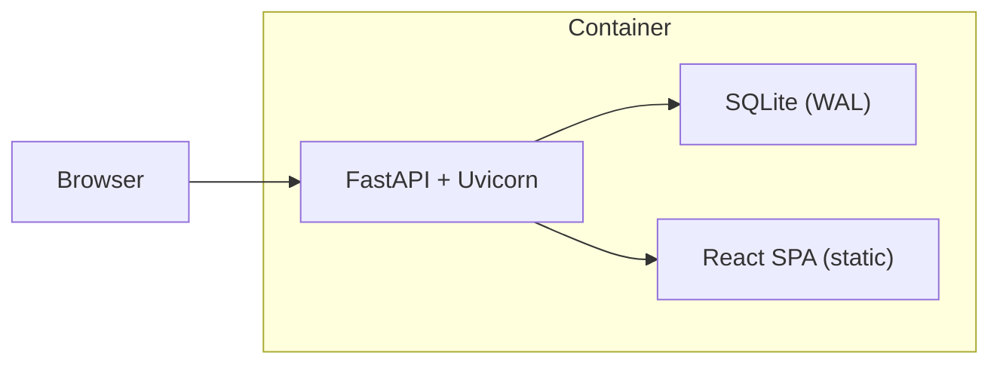
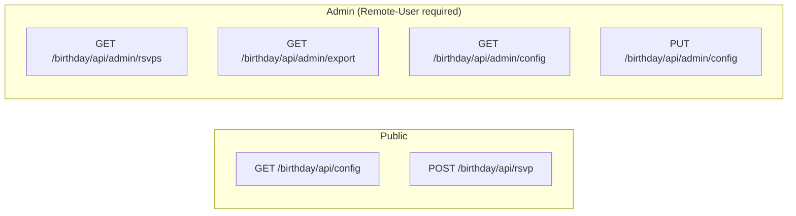

# Digital Invitation — Backend Specification

> **Status:** Frozen · **Version:** 1.0 · **Date:** 2026-10-01

---

## 1. Purpose

This document is the authoritative backend specification for **bdinvite** — an interactive digital birthday invitation with RSVP functionality. Implementation follows this spec. All API contracts, data models, authentication boundaries, and runtime behaviors described herein are normative.

---

## 2. Architecture

| Concern | Technology |
|---|---|
| Application Framework | FastAPI with Uvicorn |
| Runtime | Python 3.11+ |
| Database | SQLite with WAL mode |
| ORM | SQLAlchemy 2.0 |
| Validation & Settings | Pydantic v2 / pydantic-settings |
| Dependency Management | uv |
| Base Image | `ghcr.io/astral-sh/uv:python3.11-bookworm-slim` |

The application runs as a **single container**. FastAPI serves both the API routes and the built React SPA as static files. There is no separate web server, no reverse-proxy sidecar, and no background worker process within the container.



---

## 3. Directory Structure

```
backend/
├── pyproject.toml
├── app/
│   ├── __init__.py
│   ├── main.py              # FastAPI app, lifespan, static file mount, SPA catch-all
│   ├── config.py             # Pydantic Settings (env-based)
│   ├── database.py           # SQLite WAL engine, session factory, Base
│   ├── models.py             # SQLAlchemy models
│   ├── schemas.py            # Pydantic request/response schemas
│   ├── routes/
│   │   ├── __init__.py
│   │   ├── rsvp.py           # POST /birthday/api/rsvp
│   │   ├── config.py         # GET /birthday/api/config
│   │   └── admin.py          # Admin endpoints
│   └── services/
│       ├── __init__.py
│       ├── rsvp.py           # RSVP business logic + phone normalization
│       └── config.py         # Config CRUD + seed defaults
└── tests/
    ├── __init__.py
    ├── test_rsvp.py
    └── test_config.py
```

---

## 4. Database

### 4.1 Engine Configuration

- **Database file:** `/app/data/bdinvite.db`
- **Volume mount:** `./data:/app/data`
- **Connection string:** `sqlite:///./data/bdinvite.db`
- **WAL mode:** Enabled at engine creation via `PRAGMA journal_mode=WAL;`
- **Threading:** `check_same_thread=False` (required for SQLite with FastAPI's async/threaded model)
- **Table creation:** `metadata.create_all()` runs on application startup via FastAPI's lifespan handler

### 4.2 RSVP Table (`rsvps`)

| Column | Type | Constraints |
|---|---|---|
| `id` | INTEGER | PRIMARY KEY, autoincrement |
| `name` | TEXT | NOT NULL |
| `phone` | TEXT | NOT NULL, UNIQUE |
| `email` | TEXT | nullable |
| `created_at` | DATETIME | NOT NULL, default = `utcnow` |

The `phone` column stores the **normalized 10-digit Colombian number** (digits only, no country code). The `UNIQUE` constraint on `phone` enforces duplicate detection at the storage level.

### 4.3 InvitationConfig Table (`invitation_config`)

This table holds exactly **one row** (`id = 1`). The row is seeded with defaults on first startup if no row exists.

| Column | Type | Default |
|---|---|---|
| `id` | INTEGER | PRIMARY KEY (always `1`) |
| `title` | TEXT | `"Birthday Party"` |
| `invitation_text` | TEXT | `"You're invited to the birthday party honoring"` |
| `honoree_name` | TEXT | `"Isabelle Snow"` |
| `event_date` | TEXT | `"2026-10-28"` (ISO 8601 date) |
| `event_time` | TEXT | `"19:00"` (HH:MM, 24-hour) |
| `event_timezone` | TEXT | `"America/Bogota"` (IANA timezone identifier) |
| `address_name` | TEXT | `"Fresco Ristorante"` |
| `address_lines` | TEXT | `"514 S Brand Blvd\nGlendale, CA 91204"` (newline-separated) |
| `map_preview_url` | TEXT | URL to static map preview image |
| `map_url` | TEXT | Google Maps (or other map service) link |
| `rsvp_heading` | TEXT | `"¿Nos vemos?"` |
| `rsvp_cta` | TEXT | `"CONFIRMA TU ASISTENCIA"` |
| `submit_label` | TEXT | `"TE VEO AHÍ"` |
| `msg_success` | TEXT | `"¡Perfecto! Tu asistencia ha sido confirmada."` |
| `msg_success_greeting` | TEXT | `"Gracias, {name}."` (`{name}` is replaced client-side) |
| `msg_duplicate` | TEXT | `"Parece que ya tenemos tus datos registrados."` |
| `msg_error` | TEXT | `"No pudimos registrar tu asistencia. Inténtalo nuevamente."` |
| `msg_config_error` | TEXT | `"No pudimos cargar la invitación. Inténtalo nuevamente."` |
| `countdown_label` | TEXT | `"NOS VEMOS EN"` |
| `countdown_in_progress` | TEXT | `"EVENTO EN CURSO"` |
| `countdown_finished` | TEXT | `"EVENTO FINALIZADO"` |
| `updated_at` | DATETIME | UTC |

---

## 5. API Contract

All API routes are mounted under `/birthday/api/`. Admin routes are mounted under `/birthday/api/admin/`.



### 5.1 Public Endpoints

#### `GET /birthday/api/config`

Serves the invitation configuration to the guest frontend.

- **Auth:** None (public)
- **Response `200`:** Full `InvitationConfig` object — all fields from the config table.
- **Response `500`:** `{"result": "ERROR"}` (if no config row exists — should not happen after seeding)

#### `POST /birthday/api/rsvp`

Submit an RSVP.

- **Auth:** None (public)

**Request body:**

```json
{
  "name": "Andrés García",
  "phone": "300 123 4567",
  "email": "andres@example.com"
}
```

**Field validation:**

| Field | Required | Rules |
|---|---|---|
| `name` | Yes | Non-empty, max 100 characters, whitespace-normalized |
| `phone` | Yes | Validated as Colombian format (see §7 Phone Normalization) |
| `email` | No | Validated as email format if provided |

**Responses:**

- **`201` — Success:**
  ```json
  { "result": "SUCCESS", "name": "Andrés García" }
  ```

- **`409` — Duplicate phone:**
  ```json
  { "result": "DUPLICATE" }
  ```

- **`422` — Validation error:**
  ```json
  { "result": "VALIDATION_ERROR", "errors": { "phone": "Formato de teléfono inválido" } }
  ```

- **`500` — Server error:**
  ```json
  { "result": "ERROR" }
  ```

The `result` field is a string discriminator. The frontend switches on this value.

### 5.2 Admin Endpoints

All admin endpoints require the `Remote-User` header (injected by Authelia ForwardAuth). A missing header produces a `401` response.

#### `GET /birthday/api/admin/rsvps`

List all RSVPs.

- **Query params:** `?search=<term>` (optional) — filters by name, phone, or email substring match
- **Response `200`:**
  ```json
  {
    "count": 37,
    "rsvps": [
      {
        "id": 1,
        "name": "Ana García",
        "phone": "3001234567",
        "email": "ana@example.com",
        "created_at": "2026-09-30T12:00:00Z"
      }
    ]
  }
  ```

#### `GET /birthday/api/admin/export`

Download all RSVPs as CSV.

- **Response:** `text/csv` with `Content-Disposition: attachment; filename="rsvps.csv"`
- **Columns:** `name`, `phone`, `email`, `created_at`
- **`created_at` format:** ISO 8601 UTC

#### `GET /birthday/api/admin/config`

Get full configuration. Same shape as the public `GET /birthday/api/config`.

#### `PUT /birthday/api/admin/config`

Update configuration (full object replacement).

- **Request body:** Full config object (Pydantic-validated)
- **Response `200`:** Updated config object
- **Validation rules:**
  - `event_date` is a valid ISO 8601 date
  - `event_time` is a valid `HH:MM` (24-hour) string
  - `event_timezone` is a valid IANA timezone identifier
  - URL fields are valid URLs
  - Text fields are non-empty where required

---

## 6. Error Handling

The backend never exposes raw exceptions, SQL errors, or stack traces to the client. A global exception handler catches unhandled exceptions and returns the generic `ERROR` response.

| Scenario | HTTP Status | Response Body |
|---|---|---|
| Successful RSVP | `201` | `{"result": "SUCCESS", "name": "..."}` |
| Duplicate phone | `409` | `{"result": "DUPLICATE"}` |
| Validation failure | `422` | `{"result": "VALIDATION_ERROR", "errors": {...}}` |
| Unexpected error | `500` | `{"result": "ERROR"}` |
| Unauthenticated admin | `401` | `{"detail": "Not authenticated"}` |

---

## 7. Phone Normalization

All phone numbers are normalized to **10-digit Colombian mobile format** before storage and uniqueness checks.

**Algorithm:**

1. Strip all non-digit characters (spaces, dashes, parentheses, plus sign).
2. If the resulting digit string starts with `"57"` **and** has exactly 12 digits, remove the `"57"` prefix (country code).
3. The result must be exactly **10 digits** AND start with `"3"`.
4. If either condition fails: return validation error with message `"Formato de teléfono inválido"`.

**Examples:**

| Input | Normalized | Valid |
|---|---|---|
| `"+57 300 123 4567"` | `3001234567` | ✓ |
| `"300-123-4567"` | `3001234567` | ✓ |
| `"3001234567"` | `3001234567` | ✓ |
| `"(300) 123 4567"` | `3001234567` | ✓ |
| `"57300123 4567"` | `3001234567` | ✓ |
| `"123456"` | — | ✗ (not 10 digits) |
| `"1234567890"` | — | ✗ (doesn't start with `3`) |
| `"+1 555 123 4567"` | — | ✗ (not Colombian format) |

---

## 8. Duplicate Detection

A submission is a duplicate if the **normalized phone number** matches an existing RSVP record. Phone is the unique identifier because:

- Phone is **required** — every RSVP has one.
- Email is **optional** — cannot be relied on for deduplication.
- Name alone is **insufficient** — common names exist.

The `UNIQUE` constraint on the `phone` column enforces this at the storage level. The service layer catches the `IntegrityError` from SQLAlchemy and returns the `DUPLICATE` result.

---

## 9. Config Management

- The invitation configuration is a **singleton row** (`id = 1`) in the `invitation_config` table.
- On application startup (FastAPI lifespan), if no config row exists, seed it with defaults.
- `GET /birthday/api/config` returns the current config for the guest frontend.
- `PUT /birthday/api/admin/config` replaces the config (full object replacement, Pydantic-validated).
- The frontend fetches config on page load and renders the invitation from it.
- Changes via the admin dashboard take effect **immediately** — no cache, no restart required.

---

## 10. Admin Authentication

There is **no** app-level login page, JWT, session management, or password handling.

Authentication is delegated entirely to **Authelia** at the Traefik reverse proxy level:

1. Authelia's ForwardAuth middleware intercepts requests to `/birthday/admin/*`.
2. After successful authentication, Authelia injects headers: `Remote-User`, `Remote-Email`, `Remote-Groups`, `Remote-Name`.
3. The backend reads and verifies these headers on every admin request.

> **Security Invariant:** Every admin API endpoint independently verifies the `Remote-User` header. No admin endpoint relies on React routing, URL obscurity, or browser-side authorization for security.

**Implementation:**

```python
from fastapi import Depends, Header, HTTPException

def require_admin(remote_user: str | None = Header(None, alias="Remote-User")):
    if not remote_user:
        raise HTTPException(status_code=401, detail="Not authenticated")
    return remote_user

# Usage: every admin route depends on this
@router.get("/rsvps")
def list_rsvps(admin: str = Depends(require_admin), db: Session = Depends(get_db)):
    ...
```

---

## 11. Timestamp Policy

Two distinct timestamp domains exist in this application:

### 11.1 Persistence Timestamps

`created_at` and `updated_at` are **always UTC**. Stored as UTC in the database. The backend uses `datetime.utcnow()` or equivalent. The frontend/admin converts to display timezone as needed.

### 11.2 Event Date/Time

`event_date`, `event_time`, and `event_timezone` are stored as **separate fields** representing a locale-specific instant:

| Field | Format | Example |
|---|---|---|
| `event_date` | ISO 8601 date | `"2026-10-28"` |
| `event_time` | HH:MM (24-hour) | `"19:00"` |
| `event_timezone` | IANA timezone | `"America/Bogota"` |

The frontend constructs a timezone-aware instant from these three fields for countdown calculation.

These are **separate concerns**. Persistence timestamps are infrastructure; event time is business data.

---

## 12. SPA Serving

FastAPI serves the built React application. **Registration order matters:**

1. API routes are registered first (prefix `/birthday/api/` and `/birthday/api/admin/`).
2. Static assets are mounted at `/birthday/assets/` (Vite build output directory).
3. A catch-all route serves `static/index.html` for any `/birthday/{path}` not matching API or asset routes.

This enables React Router client-side routing under `/birthday/`.

```python
# Order matters:
app.include_router(rsvp_router, prefix="/birthday/api")
app.include_router(config_router, prefix="/birthday/api")
app.include_router(admin_router, prefix="/birthday/api/admin")

app.mount("/birthday/assets", StaticFiles(directory="static/assets"), name="assets")

@app.get("/birthday/{full_path:path}")
async def spa_catch_all(full_path: str):
    return FileResponse("static/index.html")
```

---

## 13. Application Settings

Environment-based configuration via Pydantic Settings. Values are overridable via environment variables or a `.env` file.

```python
from pydantic_settings import BaseSettings, SettingsConfigDict

class Settings(BaseSettings):
    SERVICE_NAME: str = "bdinvite"
    SERVICE_DOMAIN: str = "demos.roadtotech.me"
    BASE_PATH: str = "/birthday"
    APP_PORT: int = 8000
    DATABASE_URL: str = "sqlite:///./data/bdinvite.db"

    model_config = SettingsConfigDict(env_file=".env", extra="ignore")
```

---

## 14. Dependencies

```toml
[project]
name = "bdinvite"
version = "0.1.0"
description = "Birthday Invitation RSVP Backend"
requires-python = ">=3.11"
dependencies = [
    "fastapi>=0.115.0",
    "uvicorn>=0.30.0",
    "sqlalchemy>=2.0.0",
    "pydantic>=2.0.0",
    "pydantic-settings>=2.0.0",
]

[dependency-groups]
dev = [
    "httpx>=0.27.0",
    "pytest>=8.0.0",
    "pytest-asyncio>=0.23.0",
]
```
